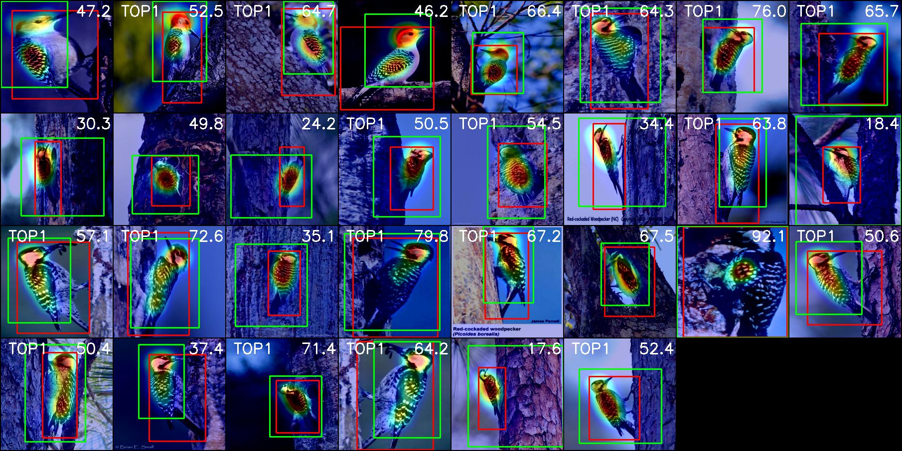

# Self-produced Guidance for Weakly-supervised Object Localization

PyTorch implementation of "Self-produced Guidance for Weakly-supervised Object Localization", [paper](https://arxiv.org/abs/1807.08902)

## Prerequisites

- Python 3.6+
- Pytorch ( >= 1.1)
- Python bindings for OpenCV
- tqdm
- tensorboardX

## Data Preparation

- [ImageNet download link](http://image-net.org/download)
- [CUB-200-2011 download link](http://www.vision.caltech.edu/visipedia/CUB-200-2011.html)


## Execution
- Train

```
git clone https://github.com/halbielee/SPG_pytorch.git
cd SPG_pytorch
# Before executing, please set the appropriate dataset path
bash script/train_[dataset].sh
```

- Evaluate

```
# Before executing, please set the appropriate dataset path
bash script/evaluate_[dataset].sh
```


## Performance
We evaluate the trained model of SPG which the author provides in our code.  

| Data         | Top1 Cls(%) | Top5 Cls(%) | Top1 Loc(%) | Top5 Loc(%) | Gt-Known |
| ------------ | ----------- | ----------- | ----------- | ----------- | -------- |
| ImageNet     | 66.158      | 87.482      | 45.656      | 58.212      | 62.800   |
| CUB-200-2011 | 68.226      | 89.990      | 46.307      | 60.200      | 64.791   |


## Qualitative Image

